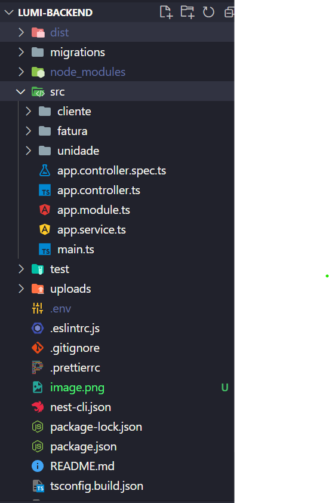
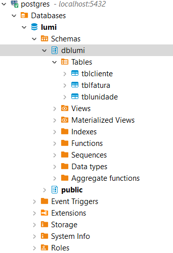

# lumi-backend
Desafio da empresa Lumi (Backend)

## Framework
 - NEST JS

 ## ORM
  - TypeORM

  ## Data Base
   - Postgres

O backend foi todo construído com o framework Nest JS, com o ORM TypeORM e algumas dependencias como Multer para manipulação de dados.

Aqui alguns prints de como foi feito:

Modelagem do banco de dados:

